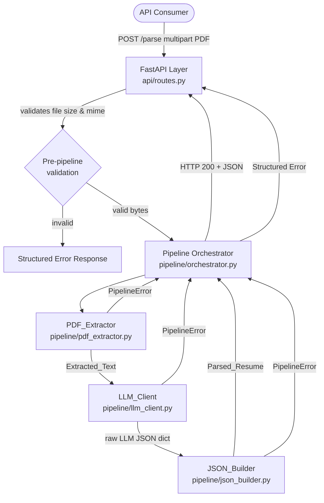

# Design Document: Resume Parser Pipeline

## Overview

The Resume Parser Pipeline is a Python/FastAPI backend service that accepts a PDF resume, extracts its text, sends the text to an LLM, and returns a validated, structured JSON object. The design favors a linear, stage-based pipeline where each component has a single responsibility and clean interfaces. All stages are orchestrated by a single pipeline controller that is exposed through a single FastAPI endpoint.

**Technology stack:**
- **Framework**: FastAPI (ASGI, async-native)
- **PDF extraction**: PyMuPDF (`fitz`)
- **HTTP client for LLM**: `httpx` (async)
- **Schema validation & serialization**: Pydantic v2
- **Logging**: Python standard `logging` with structured records

---

## Architecture



The pipeline is strictly linear: **PDF_Extractor → LLM_Client → JSON_Builder**. A failure in any stage raises a `PipelineError` that the orchestrator catches and converts into a structured error response. No stage is invoked if a preceding stage fails. Logging is injected at the orchestrator level so every stage's timing and status are captured without polluting individual components.

---

## Components and Interfaces

### PDF_Extractor

Responsible for converting raw PDF bytes into a plain-text string.

```python
# pipeline/pdf_extractor.py

def extract_text(pdf_bytes: bytes) -> str:
    """
    Extract all machine-readable text from PDF bytes.
    Pages are joined with '\n'.

    Raises:
        PipelineError(stage="pdf_extraction", error_code=...) on all failure cases.
    """
```

**Internal logic:**
1. Check `len(pdf_bytes) <= MAX_PDF_SIZE` (10 MB); raise `FILE_TOO_LARGE` if exceeded.
2. Attempt `fitz.open(stream=pdf_bytes, filetype="pdf")`; catch `fitz.FileDataError` and raise `INVALID_FILE_FORMAT`.
3. Check `doc.is_encrypted`; if so raise `FILE_ENCRYPTED`.
4. Iterate pages, collect `page.get_text("text")`; join with `\n`.
5. If joined text is empty/whitespace-only, raise `NO_READABLE_TEXT`.

---

### LLM_Client

Responsible for calling the LLM API and returning a raw Python dict.

```python
# pipeline/llm_client.py

class LLMClient:
    def __init__(self, api_key: str, endpoint: str, model: str, timeout: float = 30.0):
        ...

    async def parse(self, extracted_text: str) -> dict:
        """
        Send extracted_text to the LLM with the system prompt.
        Returns the parsed JSON dict from the LLM response.

        Raises:
            PipelineError(stage="llm_parsing", error_code=...) on all failure cases.
        """
```

**Internal logic:**
1. Build request payload: `{"model": model, "messages": [system_prompt_msg, user_msg]}`.
2. Use `httpx.AsyncClient` with `timeout=30.0`.
3. On `httpx.TimeoutException` → raise `LLM_TIMEOUT`.
4. On HTTP 4xx/5xx → retry up to 3 times with `asyncio.sleep(2**attempt)` (1 s, 2 s, 4 s); after exhausted retries → raise `LLM_API_ERROR`.
5. On 2xx: attempt `json.loads(response_content)`; on `json.JSONDecodeError` → raise `LLM_INVALID_RESPONSE_FORMAT`.
6. Return parsed dict.

The `api_key` is always read from the environment variable `LLM_API_KEY` at startup via a config module; it is never stored in source code.

---

### JSON_Builder

Responsible for validating a raw dict against the `ParsedResume` Pydantic schema and serializing/deserializing `ParsedResume` objects.

```python
# pipeline/json_builder.py

def build(raw: dict) -> ParsedResume:
    """
    Validate raw dict against ParsedResume schema.
    Returns a validated ParsedResume instance.

    Raises:
        PipelineError(stage="json_building", error_code=...) with field-level detail.
    """

def serialize(resume: ParsedResume) -> str:
    """Serialize ParsedResume to a JSON string."""

def deserialize(json_str: str) -> ParsedResume:
    """
    Deserialize a JSON string into a validated ParsedResume.
    Validates against schema after deserialization.

    Raises:
        PipelineError on parse failure or schema mismatch.
    """
```

**Internal logic for `build`:**
1. Attempt `ParsedResume.model_validate(raw)`; on `pydantic.ValidationError` → collect all errors and raise `SCHEMA_VALIDATION_ERROR` with field-level detail.
2. Return validated instance.

**Internal logic for `deserialize`:**
1. Attempt `json.loads(json_str)`; on `json.JSONDecodeError` → raise `MALFORMED_LLM_RESPONSE`.
2. Call `build(parsed_dict)`.

---

### Pipeline Orchestrator

Coordinates the three stages, handles timing, logging, and error propagation.

```python
# pipeline/orchestrator.py

async def run_pipeline(pdf_bytes: bytes) -> ParsedResume:
    """
    Execute PDF_Extractor → LLM_Client → JSON_Builder in sequence.
    Logs each stage's name, status, and duration_ms.
    Logs total duration_ms on completion.

    Raises:
        PipelineError on any stage failure (original error is re-raised, not wrapped).
    """
```

---

### API Layer

Single FastAPI router that handles multipart upload, pre-pipeline validation, and response formatting.

```python
# api/routes.py

router = APIRouter()

@router.post("/parse", response_model=ParsedResume)
async def parse_resume(file: UploadFile = File(...)) -> JSONResponse:
    """
    Accepts a PDF file ≤ 10 MB.
    Returns Parsed_Resume JSON on success (HTTP 200).
    Returns structured error response on failure.
    """
```

**Pre-pipeline validation (before orchestrator is called):**
1. Check `file.content_type == "application/pdf"` or filename ends in `.pdf`.
2. Read file bytes; check `len(bytes) <= 10 * 1024 * 1024`; if exceeded raise `FILE_TOO_LARGE` immediately.

---

## Data Models

All models live in `models/schemas.py`.

```python
# models/schemas.py
from __future__ import annotations
from typing import Optional
from pydantic import BaseModel, field_validator, model_validator

class ExperienceObject(BaseModel):
    company: Optional[str] = None
    title: Optional[str] = None
    start_date: Optional[str] = None
    end_date: Optional[str] = None
    description: Optional[str] = None

class EducationObject(BaseModel):
    institution: Optional[str] = None
    degree: Optional[str] = None
    field_of_study: Optional[str] = None
    graduation_year: Optional[str] = None

class ParsedResume(BaseModel):
    name: Optional[str] = None
    email: Optional[str] = None
    phone: Optional[str] = None
    summary: Optional[str] = None
    skills: list[str] = []
    experience: list[ExperienceObject] = []
    education: list[EducationObject] = []

    model_config = {"populate_by_name": True}
```

**Null-coercion rule**: All optional string fields default to `None` (not empty string). When the LLM omits a field, Pydantic fills it with `None`. This satisfies Requirement 3.8.

**Serialization**: `ParsedResume.model_dump_json()` produces the canonical JSON string. `ParsedResume.model_validate_json(json_str)` is used for deserialization with built-in validation.

---

### Error Response Model

```python
# models/errors.py
from pydantic import BaseModel
from enum import Enum

class PipelineStage(str, Enum):
    PRE_VALIDATION = "pre_validation"
    PDF_EXTRACTION = "pdf_extraction"
    LLM_PARSING = "llm_parsing"
    JSON_BUILDING = "json_building"

class ErrorCode(str, Enum):
    FILE_TOO_LARGE = "FILE_TOO_LARGE"
    INVALID_FILE_FORMAT = "INVALID_FILE_FORMAT"
    FILE_ENCRYPTED = "FILE_ENCRYPTED"
    NO_READABLE_TEXT = "NO_READABLE_TEXT"
    LLM_API_ERROR = "LLM_API_ERROR"
    LLM_TIMEOUT = "LLM_TIMEOUT"
    LLM_INVALID_RESPONSE_FORMAT = "LLM_INVALID_RESPONSE_FORMAT"
    MALFORMED_LLM_RESPONSE = "MALFORMED_LLM_RESPONSE"
    SCHEMA_VALIDATION_ERROR = "SCHEMA_VALIDATION_ERROR"
    INTERNAL_ERROR = "INTERNAL_ERROR"

class PipelineError(Exception):
    def __init__(self, error_code: ErrorCode, message: str, stage: PipelineStage, details: dict | None = None):
        self.error_code = error_code
        self.message = message
        self.stage = stage
        self.details = details or {}
        super().__init__(message)

class ErrorResponse(BaseModel):
    error_code: str
    message: str
    stage: str
    details: dict = {}
```

---

## File/Module Structure

```
backend/
├── app/
│   ├── __init__.py
│   ├── main.py                  # FastAPI app factory, lifespan, global exception handler
│   ├── config.py                # Settings via pydantic-settings (reads env vars)
│   ├── api/
│   │   ├── __init__.py
│   │   └── routes.py            # POST /parse endpoint
│   ├── pipeline/
│   │   ├── __init__.py
│   │   ├── orchestrator.py      # run_pipeline() — stage sequencing + logging
│   │   ├── pdf_extractor.py     # extract_text()
│   │   ├── llm_client.py        # LLMClient class
│   │   └── json_builder.py      # build(), serialize(), deserialize()
│   └── models/
│       ├── __init__.py
│       ├── schemas.py           # ParsedResume, ExperienceObject, EducationObject
│       └── errors.py            # PipelineError, ErrorResponse, enums
├── tests/
│   ├── __init__.py
│   ├── conftest.py              # shared fixtures (synthetic PDFs, mock LLM responses)
│   ├── test_pdf_extractor.py
│   ├── test_llm_client.py
│   ├── test_json_builder.py
│   ├── test_orchestrator.py
│   └── test_api.py
├── pyproject.toml               # dependencies, tool config
└── .env.example                 # LLM_API_KEY=, LLM_ENDPOINT=, LLM_MODEL=
```

---

## Configuration

```python
# app/config.py
from pydantic_settings import BaseSettings

class Settings(BaseSettings):
    llm_api_key: str              # from LLM_API_KEY env var
    llm_endpoint: str             # from LLM_ENDPOINT env var
    llm_model: str = "gpt-4o-mini"
    llm_timeout: float = 30.0
    max_pdf_size_bytes: int = 10 * 1024 * 1024  # 10 MB
    max_retries: int = 3

    class Config:
        env_file = ".env"

settings = Settings()
```

The `Settings` instance is created once at module import. No API key ever appears in source code.

---

## LLM System Prompt Design

The system prompt is defined as a constant in `pipeline/llm_client.py`:

```python
SYSTEM_PROMPT = """\
You are a resume parser. You will receive the plain text of a resume.
Your task is to extract structured information and return ONLY a valid JSON object.
Do not include any explanations, markdown, or code fences — only raw JSON.

The JSON object MUST conform to this exact schema:
{
  "name": <string or null>,
  "email": <string or null>,
  "phone": <string or null>,
  "summary": <string or null>,
  "skills": [<string>, ...],
  "experience": [
    {
      "company": <string or null>,
      "title": <string or null>,
      "start_date": <string or null>,
      "end_date": <string or null>,
      "description": <string or null>
    }
  ],
  "education": [
    {
      "institution": <string or null>,
      "degree": <string or null>,
      "field_of_study": <string or null>,
      "graduation_year": <string or null>
    }
  ]
}

Rules:
- Use null (not empty string "") for any field not present in the resume.
- Do not invent information not present in the resume.
- Return only the JSON object, nothing else.
"""
```

The user message is simply:

```
Resume text:
{extracted_text}
```

This prompt is designed to minimize the likelihood of the LLM wrapping its response in markdown fences (which would cause JSON parse failures) by explicitly instructing "raw JSON only." If the LLM still wraps in fences, the `LLM_Client` will attempt to strip a leading ` ```json ` / trailing ` ``` ` before attempting `json.loads`.

---

## Error Handling Strategy

| Error Code | Stage | HTTP Status | Cause |
|---|---|---|---|
| `FILE_TOO_LARGE` | `pre_validation` | 413 | File > 10 MB |
| `INVALID_FILE_FORMAT` | `pre_validation` / `pdf_extraction` | 422 | Not a valid PDF |
| `FILE_ENCRYPTED` | `pdf_extraction` | 422 | Password-protected PDF |
| `NO_READABLE_TEXT` | `pdf_extraction` | 422 | Empty / image-only PDF |
| `LLM_TIMEOUT` | `llm_parsing` | 504 | LLM did not respond within 30 s |
| `LLM_API_ERROR` | `llm_parsing` | 502 | LLM returned 4xx/5xx after retries |
| `LLM_INVALID_RESPONSE_FORMAT` | `llm_parsing` | 502 | LLM 2xx but non-JSON body |
| `MALFORMED_LLM_RESPONSE` | `json_building` | 502 | JSON parse failure inside builder |
| `SCHEMA_VALIDATION_ERROR` | `json_building` | 502 | Pydantic validation failure with field detail |
| `INTERNAL_ERROR` | any | 500 | Unexpected exception |

**Global exception handler** in `main.py` catches any unhandled exception and maps it to a 500 `INTERNAL_ERROR` response using the `ErrorResponse` model, ensuring the API never leaks stack traces.

**Retry backoff** for LLM errors: `asyncio.sleep(2 ** attempt)` where `attempt` goes 0, 1, 2 → sleeps 1 s, 2 s, 4 s between attempts.

---

## Logging Approach

Standard Python `logging` with structured log records. Each log entry is emitted as a JSON-formatted string to stdout so it can be ingested by any log aggregator.

```python
# app/main.py
import logging, json

class JsonFormatter(logging.Formatter):
    def format(self, record: logging.LogRecord) -> str:
        payload = {
            "timestamp": self.formatTime(record),
            "level": record.levelname,
            "message": record.getMessage(),
        }
        if hasattr(record, "extra"):
            payload.update(record.extra)
        return json.dumps(payload)
```

The orchestrator emits these records:

```python
# Per stage (on completion or failure):
logger.info("stage_complete", extra={
    "extra": {
        "stage": "pdf_extraction",
        "status": "success",        # or "failure"
        "duration_ms": 42,
    }
})

# On pipeline completion:
logger.info("pipeline_complete", extra={
    "extra": {
        "status": "success",        # or "failure"
        "total_duration_ms": 1234,
        "error_code": None,         # or the error code string on failure
    }
})
```

Timing is captured with `time.perf_counter()` around each stage call. No external logging library is required.

---

## Correctness Properties

*A property is a characteristic or behavior that should hold true across all valid executions of a system — essentially, a formal statement about what the system should do. Properties serve as the bridge between human-readable specifications and machine-verifiable correctness guarantees.*

### Property 1: Text extraction preserves all page content

*For any* list of non-empty page strings assembled into a synthetic PDF, extracting text from that PDF SHALL return a string containing all page strings joined by `\n` in the original page order.

**Validates: Requirements 1.1, 1.2**

---

### Property 2: Null coercion for missing optional fields

*For any* dict that is a valid `ParsedResume` with a random non-empty subset of optional string fields (`name`, `email`, `phone`, `summary`, and nested string fields) omitted or set to `None`, building a `ParsedResume` from that dict SHALL produce an object where every omitted field is `None` (not an empty string, not absent from the model).

**Validates: Requirements 3.8**

---

### Property 3: Schema validation failure reports field-level detail

*For any* dict that is missing required structure or contains wrong-typed fields, the `JSON_Builder` SHALL raise a `PipelineError` with `error_code = SCHEMA_VALIDATION_ERROR` and a `details` payload that references each failing field by name.

**Validates: Requirements 3.4**

---

### Property 4: Serialization round-trip identity

*For any* valid `ParsedResume` object (with any combination of null and non-null fields, any-length lists), serializing it to a JSON string and then deserializing that string SHALL produce a `ParsedResume` object whose fields are equal to the original.

**Validates: Requirements 5.1, 5.2, 5.3**

---

### Property 5: LLM request always contains extracted text and system prompt

*For any* non-empty `extracted_text` string, calling `LLMClient.parse` with a mocked HTTP transport SHALL produce an outgoing request whose body contains both the `extracted_text` and the `SYSTEM_PROMPT` constant.

**Validates: Requirements 2.1**

---

### Property 6: Pipeline error responses always contain required fields

*For any* simulated pipeline failure at any stage (pdf_extraction, llm_parsing, json_building), the `ErrorResponse` returned SHALL contain non-null, non-empty values for `error_code`, `message`, and `stage`.

**Validates: Requirements 4.3**

---

### Property 7: Pipeline logging captures stage metrics for every run

*For any* pipeline execution (success or failure with any stage failing), the log output SHALL contain one entry per executed stage with `stage`, `status`, and `duration_ms` keys, plus a final entry with `total_duration_ms`.

**Validates: Requirements 4.5**

---

## Testing Strategy

### Unit Tests

Unit tests cover specific examples, edge cases, and error conditions for each component in isolation.

**`test_pdf_extractor.py`**
- Extract text from a synthetic single-page PDF (example)
- Error on empty PDF (edge case)
- Error on image-only PDF (edge case)
- Error on non-PDF bytes (example)
- Error on file size exactly at boundary and one byte over (edge case)
- Error on password-protected PDF (example)

**`test_llm_client.py`**
- Returns parsed dict on 2xx JSON response (example)
- Raises `LLM_INVALID_RESPONSE_FORMAT` on 2xx non-JSON response (example)
- Raises `LLM_TIMEOUT` on httpx timeout (example)
- Retries 3 times with correct sleep intervals on 5xx (example with mocked `asyncio.sleep`)

**`test_json_builder.py`**
- Raises `MALFORMED_LLM_RESPONSE` on unparseable JSON string (example)
- Returns validated `ParsedResume` on valid dict (example)

**`test_orchestrator.py`**
- Returns `ParsedResume` on all-stage success (integration via mocks)
- Propagates `PipelineError` from each stage without wrapping (example)

**`test_api.py`**
- Returns 200 + JSON on valid PDF upload (integration via `httpx.AsyncClient`)
- Returns 413 on oversized file
- Returns 422 on non-PDF file

### Property-Based Tests

Property tests use **[Hypothesis](https://hypothesis.readthedocs.io/)** (the standard Python PBT library). Each test runs a minimum of 100 iterations.

**`test_pdf_extractor.py`** — Property 1
```
# Feature: resume-parser-pipeline, Property 1: text extraction preserves all page content
@given(pages=st.lists(st.text(min_size=1), min_size=1, max_size=10))
def test_extraction_preserves_page_content(pages): ...
```

**`test_json_builder.py`** — Property 2
```
# Feature: resume-parser-pipeline, Property 2: null coercion for missing optional fields
@given(resume_dict=partial_parsed_resume_strategy())
def test_null_coercion(resume_dict): ...
```

**`test_json_builder.py`** — Property 3
```
# Feature: resume-parser-pipeline, Property 3: schema validation failure reports field-level detail
@given(bad_dict=invalid_resume_strategy())
def test_validation_error_has_field_detail(bad_dict): ...
```

**`test_json_builder.py`** — Property 4
```
# Feature: resume-parser-pipeline, Property 4: serialization round-trip identity
@given(resume=valid_parsed_resume_strategy())
def test_serialization_round_trip(resume): ...
```

**`test_llm_client.py`** — Property 5
```
# Feature: resume-parser-pipeline, Property 5: LLM request always contains extracted text and system prompt
@given(text=st.text(min_size=1))
def test_request_contains_text_and_prompt(text): ...
```

**`test_api.py`** — Property 6
```
# Feature: resume-parser-pipeline, Property 6: pipeline error responses always contain required fields
@given(failing_stage=st.sampled_from(PipelineStage))
def test_error_response_has_required_fields(failing_stage): ...
```

**`test_orchestrator.py`** — Property 7
```
# Feature: resume-parser-pipeline, Property 7: pipeline logging captures stage metrics for every run
@given(fail_at=st.one_of(st.none(), st.sampled_from(["pdf_extraction", "llm_parsing", "json_building"])))
def test_logging_captures_stage_metrics(fail_at): ...
```

**Hypothesis configuration** (in `conftest.py`):
```python
settings.register_profile("ci", max_examples=100)
settings.load_profile("ci")
```
